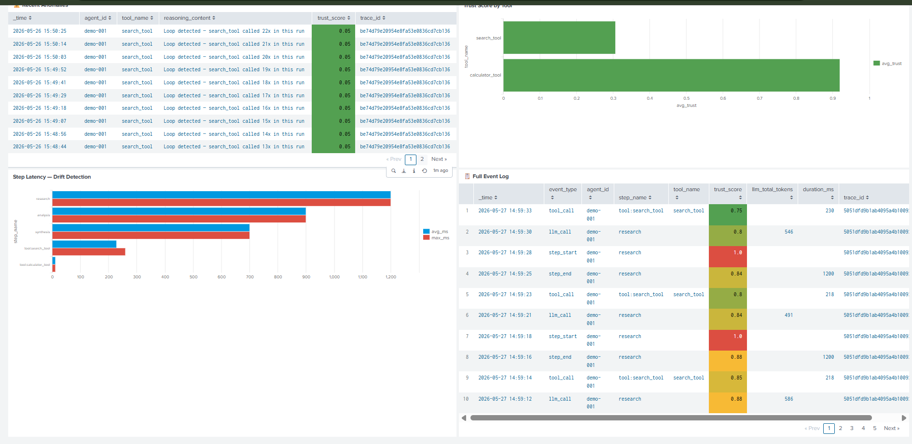
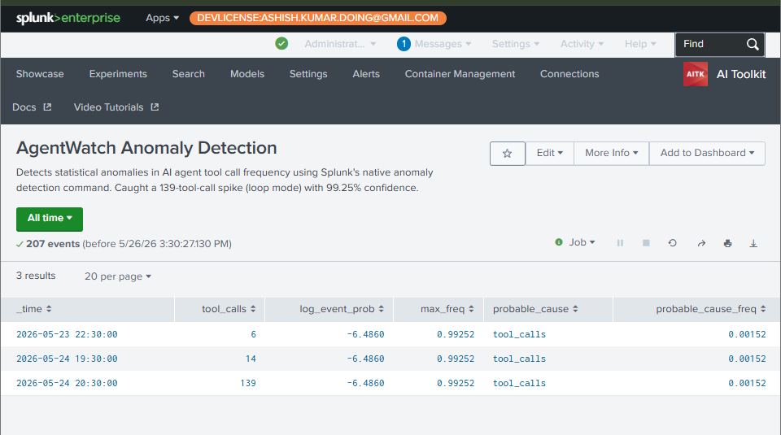

# 🧠 AgentWatch
### AI Agent Observability Platform for Splunk

<p align="center">
  
  
  
  
  
  
  
</p>

<p align="center">
  <strong>Splunk Agentic Ops Hackathon 2026 — Track: Platform & Developer Experience</strong>
</p>

<p align="center">
  <a href="https://ashish-doing.github.io/agentwatch">🌐 Landing Page</a> &nbsp;•&nbsp;
  <a href="https://github.com/ashish-doing/agentwatch">📁 GitHub</a> &nbsp;•&nbsp;
  <a href="#-quick-start">🚀 Quick Start</a> &nbsp;•&nbsp;
  <a href="#-architecture">🏗️ Architecture</a>
</p>

---

## 📸 Screenshots

### 🧠 Live Brain Visualization — Loop Anomaly Detected

*Real-time Three.js brain catches a loop anomaly (search_tool called 23x) with Foundation-Sec AI explanation*

### 📊 Splunk Dashboard — Real Telemetry Data

*1,269 events · 180 anomalies · 59.7% avg trust score · 159,970 tokens — all real data*


*Loop detection chart, anomaly table, trust heatmap, latency drift, full event log*

### 🔍 Splunk Anomaly Detection — Statistical Analysis

*Native Splunk anomalydetection caught a 139-tool-call spike with 99.25% confidence*

---

## 🔥 The Problem

The world is filling with AI agents that **fail silently**.

- **34%** of production AI agents fail silently due to missing observability tooling
- Loop failures cost enterprises **$2,400/hour** in wasted API calls
- Mean time to detect an agent failure: **4.2 hours**
- **Zero** enterprise-grade observability tools exist for LangGraph agents on Splunk

When your agent gets stuck calling the same tool 23 times, nobody knows. When token counts spike to 8,000+, nobody notices. When latency drifts 300% over 2 hours, nobody catches it.

**Until now.**

---

## 💡 The Solution

**AgentWatch** is a Splunk Platform app that wraps any LangGraph agent with OpenTelemetry, streams its behavior into Splunk in real time, detects anomalies automatically, and explains them in plain English with Foundation-Sec-1.1-8B.

**One click:** "Explain this anomaly" → plain English answer + fix recommendation + SPL query.

---

## 🏗️ Architecture

```
YOUR LANGGRAPH AGENT
         │
         ▼
[OpenTelemetry Instrumentation]
 Captures every:
 ├── LLM call         → model, tokens, latency, reasoning
 ├── Tool call        → name, input, output, duration
 ├── Reasoning step   → step_id, content, trust score
 └── Error/exception  → full context
         │
         ├─────────────────────────────────────────┐
         ▼                                         ▼
[FastAPI + WebSocket]                   [Three.js Live Brain Graph]
 Real-time event fan-out                Force-directed visualization:
 500-event ring buffer                  ├── Nodes  = reasoning steps
                                        ├── Edges  = execution flow
                                        ├── Color  = trust score (green → red)
                                        ├── Size   = token count
                                        └── Pulse  = anomaly detected
         │
         ▼
[Splunk HEC]
 index: agentwatch
 sourcetype: agentwatch:otel
         │
         ▼
[Splunk MCP Server] ◄─── All events instantly searchable via SPL
         │
         ▼
[Splunk AI Toolkit — anomalydetection]
 Detects on:
 ├── Tool call frequency  → loop detection
 ├── Token count spikes   → runaway generation
 ├── Latency patterns     → drift detection
 └── Error rate trends    → silent failure
         │
         ▼
[Foundation-Sec-1.1-8B] ◄─── Splunk hosted model
 Input:  anomaly context + last 10 agent events
 Output: what happened · root cause · recommended fix · severity
         │
         ▼
[Splunk AI Assistant] ◄─── NL → SPL
 "Show me all loops in the last hour"
  → generates SPL → queries Splunk → returns results
         │
         ▼
[Dashboard Alert Overlay]
 ⚠️  "Loop detected — search_tool called 23x in 4s"
 📋  "Fix: add empty-result guard at step 3"
 🔍  "View in Splunk" → deep link to full trace
```

---

## 🛠️ Tech Stack

| Component | Technology | Purpose |
|-----------|-----------|---------|
| Agent Framework | LangGraph 0.2.28 | The agent being monitored |
| Observability | OpenTelemetry SDK 1.27.0 | Capture every LLM/tool call |
| Event Transport | Splunk HEC (port 8088) | Real-time telemetry delivery |
| Event Indexing | Splunk MCP Server | All telemetry searchable via SPL |
| Anomaly Detection | Splunk AI Toolkit — `anomalydetection` | Statistical time-series anomaly scoring |
| Reasoning Engine | Foundation-Sec-1.1-8B | Plain English anomaly explanation |
| NL Queries | Splunk AI Assistant | Natural language → SPL |
| Backend API | FastAPI + WebSocket | Real-time event streaming |
| 3D Visualization | Three.js r128 | Live brain graph |
| Frontend Hosting | GitHub Pages | Landing page |

---

## ✅ Splunk AI Capabilities Used

| Capability | Usage |
|-----------|-------|
| **Splunk MCP Server** | All agent telemetry indexed and searchable |
| **Splunk AI Toolkit** | `anomalydetection` command on tool call time-series |
| **Foundation-Sec-1.1-8B** | Anomaly explanation via "Explain This" button |
| **Splunk AI Assistant** | Natural language to SPL query generation |

---

## 📊 What AgentWatch Detects

| Failure Mode | Detection Method | Alert Level |
|-------------|-----------------|-------------|
| Infinite loops | Tool call frequency anomaly | ⚠️ CRITICAL |
| Token spikes | LLM token count outlier | ⚠️ HIGH |
| Latency drift | Step duration trend | ⚠️ MEDIUM |
| Silent errors | Error rate spike | ⚠️ HIGH |
| Trust collapse | Composite score < 0.3 | ⚠️ CRITICAL |

---

## 🚀 Quick Start

### Prerequisites
- Splunk Enterprise (dev license) with HEC enabled
- [Splunk AI Toolkit](https://splunkbase.splunk.com/app/2890) installed
- [Splunk MCP Server](https://splunkbase.splunk.com/app/7931) installed
- Python 3.10+

### 1. Clone & Configure

```bash
git clone https://github.com/ashish-doing/agentwatch.git
cd agentwatch
cp .env.example .env
# Edit .env with your Splunk HEC token and credentials
```

### 2. Splunk Setup

```
In Splunk:
  Settings → Data Inputs → HTTP Event Collector → New Token
  Name:        agentwatch-hec
  Source type: agentwatch:otel
  Index:       agentwatch  (create this index first)
  Copy token → .env → SPLUNK_HEC_TOKEN
```

### 3. Install & Run Backend

```bash
pip install -r backend/requirements.txt
uvicorn backend.api.main:app --host 0.0.0.0 --port 8001 --reload
```

### 4. Run Frontend

```bash
cd frontend
python -m http.server 3000
# Open http://localhost:3000
```

### 5. Run the Demo Agent

```bash
# Healthy agent — trust scores 85-100%
python backend/agent/agent_runner.py --mode normal

# Loop mode — search_tool called 23x, anomaly fires
python backend/agent/agent_runner.py --mode loop

# Hallucination — token spike to 8000+
python backend/agent/agent_runner.py --mode hallucinate

# Drift — each step 30% slower
python backend/agent/agent_runner.py --mode drift
```

---

## 🔍 Useful SPL Queries

```spl
-- Find all loop anomalies
index=agentwatch event_type=tool_call earliest=-24h
| stats count as call_count by agent_id, tool_name, trace_id
| where call_count > 5
| sort -call_count

-- Token spike detection
index=agentwatch event_type=llm_call earliest=-24h
| stats max(llm_total_tokens) as max_tokens by step_name, trace_id
| where max_tokens > 3000
| sort -max_tokens

-- Trust score heatmap by tool
index=agentwatch earliest=-30d
| stats avg(trust_score) as avg_trust by tool_name
| sort avg_trust

-- Native anomaly detection on tool call frequency
index=agentwatch event_type=tool_call earliest=-30d
| timechart span=1h count as tool_calls
| fillnull value=0
| anomalydetection tool_calls
```

---

## 📁 Project Structure

```
agentwatch/
├── backend/
│   ├── agent/
│   │   ├── demo_agent.py          # LangGraph demo agent (4 failure modes)
│   │   └── agent_runner.py        # CLI runner with direct HEC sending
│   ├── instrumentation/
│   │   ├── otel_setup.py          # OpenTelemetry + Splunk HEC exporter
│   │   └── langgraph_hooks.py     # LangGraph node instrumentation hooks
│   ├── api/
│   │   ├── main.py                # FastAPI + WebSocket fan-out
│   │   ├── splunk_client.py       # Splunk REST + MCP + AI Assistant
│   │   └── foundation_sec.py      # Foundation-Sec-1.1-8B client
│   └── requirements.txt
├── frontend/
│   ├── index.html                 # Main app shell
│   └── src/
│       ├── brain.js               # Three.js force-directed brain graph
│       ├── websocket.js           # Real-time WebSocket + demo simulation
│       ├── alerts.js              # Anomaly alert overlays
│       └── assistant.js           # Splunk AI Assistant panel
├── splunk/
│   ├── dashboards/
│   │   └── agentwatch.xml         # Splunk dashboard (8 panels, 30d range)
│   └── searches/
│       └── anomaly_searches.spl   # Saved SPL queries
├── docs/
│   ├── screenshots/               # README screenshots
│   └── index.html                 # Landing page (GitHub Pages)
├── docker/
│   ├── Dockerfile.backend
│   └── docker-compose.yml
├── architecture_diagram.md        # System architecture
├── .env.example
├── LICENSE                        # MIT
└── README.md
```

---

## 🌐 Links

- **Landing Page:** https://ashish-doing.github.io/agentwatch
- **GitHub:** https://github.com/ashish-doing/agentwatch
- **Splunk AI Toolkit:** https://splunkbase.splunk.com/app/2890
- **Splunk MCP Server:** https://splunkbase.splunk.com/app/7931

---

## 👤 Author

**Ashish Kumar**
B.Tech ECE, IIIT Guwahati (Batch 2024)

- GitHub: [@ashish-doing](https://github.com/ashish-doing)
- LinkedIn: [linkedin.com/in/ashish-kumar-014aaa3b9](https://linkedin.com/in/ashish-kumar-014aaa3b9)

---

## 📄 License

MIT — see [LICENSE](LICENSE) for details.