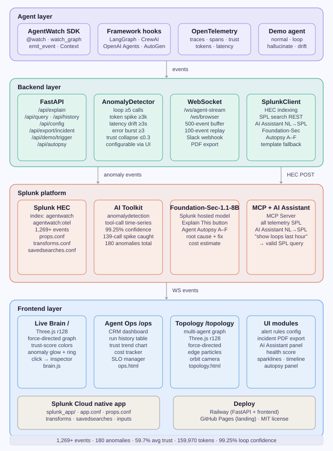
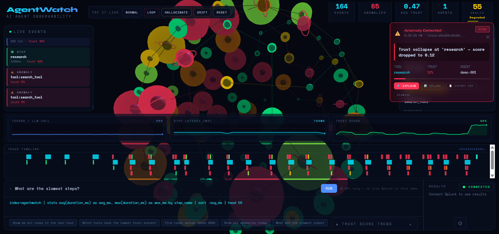
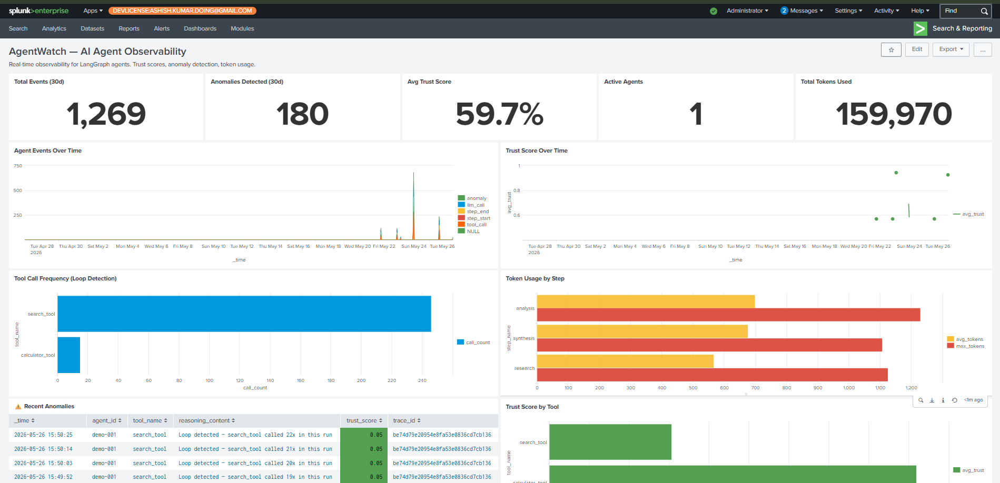

# 🧠 AgentWatch
### AI Agent Observability Platform for Splunk

<p align="center">
  
  
  
  
  
  
  
  
  
</p>

<p align="center">
  <strong>Splunk Agentic Ops Hackathon 2026 — Track: Platform & Developer Experience</strong>
</p>

<p align="center">
  🌐 <a href="https://ashish-doing.github.io/agentwatch">Landing Page</a> &nbsp;•&nbsp;
  🚀 <a href="https://agentwatch-production-4a86.up.railway.app">Live Demo</a> &nbsp;•&nbsp;
  📊 <a href="https://agentwatch-production-4a86.up.railway.app/ops">Agent Ops Dashboard</a> &nbsp;•&nbsp;
  🗺️ <a href="https://agentwatch-production-4a86.up.railway.app/topology">Topology Map</a> &nbsp;•&nbsp;
  ⚡ <a href="#quick-start">Quick Start</a>
</p>

---

## The Problem Nobody's Solving (Until Now)

**1,269 events indexed. 180 anomalies detected. 5 Splunk AI capabilities unified in a single pipeline.**

AI agents are entering production every day — and failing silently. When your LangGraph agent calls the same tool 23 times in 4 seconds, when token counts spike to 8,000+, when trust scores collapse to 5% — nobody notices until users are screaming or your API bill arrives. AgentWatch is the first Splunk-native platform that watches every heartbeat of your AI agent in real time, catches failures before they cascade, and explains them in plain English.

---

## 🔥 The Problem

- **34%** of production AI agents fail silently due to missing observability tooling
- Loop failures cost enterprises **$2,400/hour** in wasted API calls
- Mean time to detect an agent failure: **4.2 hours**
- **Zero** enterprise-grade observability tools exist natively on Splunk

**Until now.**

---

## 💡 The Solution

**AgentWatch** is a Splunk Platform app that wraps any LangGraph, CrewAI, or OpenAI Agents SDK agent with OpenTelemetry, streams its behavior into Splunk in real time, detects anomalies automatically, explains them in plain English with Foundation-Sec-1.1-8B, and runs a full post-run **Agent Autopsy** graded A–F.

**One click:** "Explain this anomaly" → plain English root cause + recommended fix + SPL query.
**One click:** "Export Incident Report" → PDF with full Foundation-Sec reasoning + SPL queries.
**End of run:** "Run Autopsy" → performance grade, cost estimate, and fix recommendation.

---

## ⚔️ Why AgentWatch?

| Capability | AgentWatch | LangSmith | Arize Phoenix |
|---|---|---|---|
| **Splunk-native** | ✅ First & only | ❌ SaaS only | ❌ SaaS only |
| **Real-time anomaly detection** | ✅ SPL `anomalydetection` + in-process | ⚠️ Manual rules | ⚠️ Drift metrics only |
| **Plain-English root cause** | ✅ Foundation-Sec-1.1-8B | ❌ | ❌ |
| **Post-run Agent Autopsy** | ✅ Graded A–F + cost estimate | ❌ | ❌ |
| **NL → SPL** | ✅ Splunk AI Assistant | ❌ | ❌ |
| **Multi-framework** | ✅ LangGraph · CrewAI · OpenAI Agents · AutoGen | ⚠️ LangChain only | ⚠️ Manual |
| **CRM Ops Dashboard** | ✅ /ops — full run history + SLOs | ❌ | ❌ |
| **Multi-agent topology** | ✅ Three.js force-directed graph | ❌ | ❌ |
| **Alert rules configurator** | ✅ Live threshold tuning via UI | ❌ | ❌ |
| **Incident PDF export** | ✅ One-click Foundation-Sec PDF | ❌ | ❌ |
| **Slack/PagerDuty webhook** | ✅ CRITICAL anomaly → Slack | ❌ | ❌ |
| **Cost tracker** | ✅ Per-agent per-run USD estimate | ❌ | ❌ |
| **SLO manager** | ✅ Uptime · trust · loop-free SLOs | ❌ | ❌ |
| **Splunk Cloud app** | ✅ Native app packaging | ❌ | ❌ |
| **Open source** | ✅ MIT | ❌ Proprietary | ✅ |

---

## 🏗️ Architecture



The full annotated diagram with data-flow details lives in [`architecture.md`](architecture.md).

**How it flows:**

```
YOUR AGENT (LangGraph · CrewAI · OpenAI Agents · AutoGen)
         │
         ▼
[AgentWatch SDK / Framework Hooks]
 ├── @watch(agent_name="my_agent")        → decorate individual nodes
 ├── watch_graph(compiled, ...)           → instrument entire graph in one line
 ├── AgentWatchCrewAI(agent_name=...)     → CrewAI callback handler
 ├── AgentWatchOpenAI(agent_name=...)     → OpenAI Agents hook class
 └── AgentWatchAutoGen(agent_name=...)    → AutoGen message hook
         │
         ▼
[OpenTelemetry] → LLM calls · tool calls · reasoning steps · trust scores
         │
         ├──────────────────────────────────────┐
         ▼                                      ▼
[FastAPI + WebSocket]               [Three.js Live Brain /]
 500-event ring buffer               force-directed graph
 100-event replay on connect         anomaly glow · trust colors
         │
         ▼
[AnomalyDetector — in-process pre-filter]
 loop ≥5 · token spike ≥3k · latency ≥3s · error burst ≥3 · trust ≤0.3
 → all thresholds configurable via /api/config + UI
 → CRITICAL anomalies → Slack webhook notification
         │
         ▼
[Splunk HEC] → index=agentwatch · sourcetype=agentwatch:otel
         │
         ├── [Splunk AI Toolkit] — anomalydetection (99.25% confidence)
         ├── [Splunk MCP Server] — all telemetry searchable via SPL
         ├── [Splunk AI Assistant] — "show loops last hour" → valid SPL
         └── [Foundation-Sec-1.1-8B] — Explain This · Autopsy A–F · PDF export
         │
         ▼
[Three pages of UI]
 /           — Live Brain (Three.js force-directed visualization)
 /ops        — Agent Operations CRM Dashboard
 /topology   — Multi-agent topology map (second Three.js graph)
```

---

## 📸 Screenshots

### 🧠 Live Brain Visualization — Loop Anomaly Detected


### 📊 Splunk Dashboard — Real Telemetry Data


### 🗂️ Agent Operations CRM Dashboard
*Run history · trust trend chart · anomaly breakdown · SLO status · cost tracker*
Live at: https://agentwatch-production-4a86.up.railway.app/ops

### 🗺️ Multi-Agent Topology Map
*Force-directed Three.js graph · agent hubs · data flow particles · orbit camera*
Live at: https://agentwatch-production-4a86.up.railway.app/topology

---

## 🛠️ Tech Stack

| Component | Technology | Purpose |
|-----------|-----------|---------|
| Agent Framework | LangGraph 0.2.28 | Primary demo agent |
| Framework Hooks | CrewAI · OpenAI Agents · AutoGen | Multi-framework support |
| Observability | OpenTelemetry SDK 1.27.0 | Capture every LLM/tool call |
| SDK | `agentwatch_sdk.py` + `agentwatch_hooks.py` | Zero-config instrumentation |
| Event Transport | Splunk HEC (port 8088) | Real-time telemetry delivery |
| Anomaly Detection | `AnomalyDetector` + Splunk AI Toolkit | In-process + statistical |
| Reasoning Engine | Foundation-Sec-1.1-8B | Explain This · Autopsy · PDF |
| NL Queries | Splunk AI Assistant | Natural language → SPL |
| Notifications | Slack webhook | CRITICAL anomaly alerts |
| Backend API | FastAPI + WebSocket | Event streaming + all endpoints |
| 3D Visualization | Three.js r128 | Brain graph + topology map |
| Ops Dashboard | Chart.js 4.4 | Trust trend · anomaly doughnut |
| PDF Export | reportlab | Incident report generation |
| Splunk App | Native packaging | splunk_app/ — Splunkbase ready |
| Deployment | Railway | Live demo (no Splunk needed) |

---

## ✅ Splunk AI Capabilities Used

| Capability | How AgentWatch Uses It |
|-----------|-------|
| **Splunk MCP Server** | All agent telemetry indexed; SPL queries run from UI panel |
| **Splunk AI Toolkit** | `anomalydetection` on tool-call time-series — 99.25% confidence, 180 anomalies |
| **Foundation-Sec-1.1-8B** | "Explain This" per-anomaly + "Run Autopsy" full-trace graded report + PDF export |
| **Splunk AI Assistant** | NL → SPL; type "show me all loops in the last hour" → live results |

---

## 📊 What AgentWatch Detects

| Failure Mode | Detection | Alert | Configurable |
|-------------|-----------|-------|-------------|
| Infinite loops | Tool call frequency ≥5 | ⚠️ CRITICAL | ✅ UI slider |
| Token spikes | LLM tokens ≥3,000 | ⚠️ HIGH | ✅ UI slider |
| Latency drift | Step duration ≥3,000ms | ⚠️ MEDIUM | ✅ UI slider |
| Error burst | ≥3 errors in one trace | ⚠️ HIGH | ✅ UI slider |
| Trust collapse | Trust score ≤0.3 | ⚠️ CRITICAL | ✅ UI slider |

All thresholds are configurable live via the **⚙ Config** panel in the UI (no SPL edit needed).

---

## 🔭 Framework Support

AgentWatch works with any Python AI agent framework via `agentwatch_hooks.py`:

**LangGraph** (full native support):
```python
from agentwatch_sdk import watch, watch_graph
compiled = watch_graph(graph.compile(), agent_name="my_agent")
```

**CrewAI**:
```python
from agentwatch_hooks import AgentWatchCrewAI
aw = AgentWatchCrewAI(agent_name="my_crew")
agent = Agent(role="Researcher", ..., callbacks=[aw])
```

**OpenAI Agents SDK**:
```python
from agentwatch_hooks import AgentWatchOpenAI
hooks = AgentWatchOpenAI(agent_name="my_agent")
agent = Agent(name="Assistant", instructions="...", hooks=hooks)
```

**AutoGen**:
```python
from agentwatch_hooks import AgentWatchAutoGen
hook = AgentWatchAutoGen(agent_name="autogen_crew")
assistant.register_reply(trigger=autogen.ConversableAgent, reply_func=hook.on_message)
```

**Any framework** (generic decorators):
```python
from agentwatch_hooks import watch_tool, watch_llm

@watch_tool(agent_name="my_agent", tool_name="search")
def search_tool(query: str) -> str: ...

@watch_llm(agent_name="my_agent")
def call_llm(prompt: str) -> dict: ...
```

---

## 🗂️ Agent Operations Dashboard (/ops)

A CRM-style dashboard for managing a fleet of agents:

- **KPI row** — total runs, avg trust score, total anomalies, token usage, estimated cost, live events
- **Agent run history table** — sortable by trust, anomalies, cost, duration; filter by mode
- **Trust trend chart** — 30-run line chart showing trust over time
- **Anomaly breakdown** — doughnut chart by type (loop / token spike / latency drift / error burst / trust collapse)
- **SLO status** — uptime · loop-free rate · cost · run time · trust SLOs with burn indicators
- **Cost tracker** — per-run USD estimate at $0.15/1M tokens
- **Live activity feed** — real-time WebSocket event stream

---

## 🗺️ Multi-Agent Topology Map (/topology)

A second Three.js visualization showing agent-to-agent data flows:

- **Agent hub nodes** — octahedral nodes, one per agent ID
- **Step nodes** — colored by type (LLM call = blue, tool call = cyan, anomaly = red with glow ring)
- **Edge particles** — animated data flow along connections
- **Force-directed layout** — automatic positioning with repulsion + attraction physics
- **Orbit camera** — drag to rotate, scroll to zoom
- **Node inspector** — click any node → type, trust, agent, connection count

---

## 📄 Incident Report PDF Export

One-click PDF export from the alert overlay or Agent Ops dashboard:

- Incident summary table (trace ID, agent, timestamp, anomaly type, severity, trust score)
- Full Foundation-Sec reasoning (what happened, root cause, recommended fix)
- Relevant SPL queries to reproduce the incident
- AgentWatch branding + generation timestamp

---

## 🔔 Slack Notifications

Set `SLACK_WEBHOOK_URL` in `.env` to receive CRITICAL anomaly alerts:

```
🚨 AgentWatch CRITICAL: loop detected on agent demo-001
— search_tool called 23x in 4s — View trace: [Splunk deep link]
```

Gracefully skips if the env var is not set.

---

## 📦 Splunk Cloud App

`splunk_app/agentwatch/` contains a complete Splunk app package:

```
splunk_app/agentwatch/
├── default/
│   ├── app.conf           # App metadata
│   ├── indexes.conf       # agentwatch index definition
│   ├── inputs.conf        # HEC input + log monitor
│   ├── props.conf         # agentwatch:otel sourcetype config
│   ├── transforms.conf    # Field extractions (trust_score, agent_id, etc.)
│   └── savedsearches.conf # 7 pre-built searches + CRON alert for CRITICAL anomalies
└── metadata/
    └── default.meta
```

Install by uploading `splunk_app/` to Splunk Cloud or dropping into `$SPLUNK_HOME/etc/apps/`.

---

## ⚡ Quick Start

### Prerequisites
- Python 3.10+
- Splunk Enterprise with HEC enabled (or use Railway live demo — no Splunk needed)

### 1. Clone & Configure

```bash
git clone https://github.com/ashish-doing/agentwatch.git
cd agentwatch
cp .env.example .env
# Edit .env with your Splunk HEC token
# Optional: add SLACK_WEBHOOK_URL for CRITICAL anomaly notifications
```

### 2. Install & Run

```bash
pip install -r backend/requirements.txt
uvicorn backend.api.main:app --host 0.0.0.0 --port 8001 --reload
```

Open `http://localhost:8001` — all three pages available at `/`, `/ops`, `/topology`.

### 3. Run the Demo Agent

```bash
python backend/agent/agent_runner.py --mode normal      # healthy run
python backend/agent/agent_runner.py --mode loop        # loop anomaly
python backend/agent/agent_runner.py --mode hallucinate # token spike
python backend/agent/agent_runner.py --mode drift       # latency drift
```

Or trigger from the UI buttons (no terminal needed).

### 4. Try the API

```bash
# Trigger a loop demo
curl -X POST https://agentwatch-production-4a86.up.railway.app/api/demo/trigger \
  -H "Content-Type: application/json" -d '{"mode": "loop"}'

# Run autopsy on last 200 events
curl -X POST https://agentwatch-production-4a86.up.railway.app/api/autopsy \
  -H "Content-Type: application/json" -d '{"last_n_events": 200}'

# Get run history for trend chart
curl https://agentwatch-production-4a86.up.railway.app/api/history

# Get/update alert thresholds
curl https://agentwatch-production-4a86.up.railway.app/api/config
curl -X POST https://agentwatch-production-4a86.up.railway.app/api/config \
  -H "Content-Type: application/json" -d '{"loop_threshold": 3}'
```

---

## 📡 API Reference

| Method | Endpoint | Purpose |
|--------|----------|---------|
| `WS` | `/ws/agent-stream` | Agent → backend event stream |
| `WS` | `/ws/browser` | Backend → browser live events |
| `POST` | `/api/explain` | Anomaly explanation via Foundation-Sec |
| `POST` | `/api/query` | NL → SPL via AI Assistant |
| `POST` | `/api/autopsy` | Post-run trace analysis, grade A–F |
| `POST` | `/api/demo/trigger` | Trigger demo run (normal/loop/hallucinate/drift) |
| `GET` | `/api/demo/status` | Check if demo is running |
| `GET` | `/api/events` | Recent events from ring buffer |
| `GET` | `/api/stats` | Live stats (events, anomalies, trust, connections) |
| `GET` | `/api/history` | Last 30 run summaries for trust trend chart |
| `GET` | `/api/config` | Current alert thresholds |
| `POST` | `/api/config` | Update alert thresholds live |
| `POST` | `/api/export/incident` | Generate PDF incident report |
| `GET` | `/api/health` | Backend health + Splunk connectivity |
| `GET` | `/` | Live Brain visualization |
| `GET` | `/ops` | Agent Operations CRM Dashboard |
| `GET` | `/topology` | Multi-agent topology map |

---

## 🔍 Useful SPL Queries

```spl
-- All anomalies
index=agentwatch event_type=anomaly | sort -_time
| table _time, agent_id, anomaly_type, severity, trust_score, reasoning_content

-- Loop detection
index=agentwatch event_type=tool_call
| stats count as calls by trace_id, tool_name | where calls >= 5 | sort -calls

-- Trust trend over time
index=agentwatch trust_score=* | timechart span=5m avg(trust_score) by agent_id

-- Token spikes
index=agentwatch event_type=llm_call llm_total_tokens>=3000
| table _time, agent_id, trace_id, llm_total_tokens, step_name

-- Native Splunk anomaly detection
index=agentwatch event_type=tool_call | timechart span=1h count as tool_calls
| anomalydetection tool_calls
```

---

## 📁 Project Structure

```
agentwatch/
├── backend/
│   ├── agent/
│   │   ├── demo_agent.py          # LangGraph demo agent (4 failure modes)
│   │   ├── agent_runner.py        # CLI runner
│   │   └── demo_runner_lib.py     # In-process demo trigger
│   ├── instrumentation/
│   │   ├── otel_setup.py          # OpenTelemetry + HEC exporter
│   │   ├── langgraph_hooks.py     # LangGraph node hooks
│   │   └── anomaly_detector.py    # In-process pre-filter (5 anomaly types)
│   ├── api/
│   │   ├── main.py                # FastAPI + WebSocket + all endpoints
│   │   ├── splunk_client.py       # Splunk REST + MCP + AI Assistant
│   │   ├── foundation_sec.py      # Foundation-Sec-1.1-8B client
│   │   └── autopsy.py             # Post-run Agent Autopsy (grade A–F)
│   ├── agentwatch_sdk.py          # Zero-config @watch / watch_graph SDK
│   ├── agentwatch_hooks.py        # CrewAI / OpenAI Agents / AutoGen hooks
│   └── requirements.txt
├── frontend/
│   ├── index.html                 # Live Brain (main app)
│   ├── ops.html                   # Agent Operations CRM Dashboard
│   ├── topology.html              # Multi-agent topology map
│   └── src/
│       ├── brain.js               # Three.js force-directed brain graph
│       ├── websocket.js           # WebSocket + demo simulation
│       ├── alerts.js              # Anomaly alert overlays + PDF export
│       ├── assistant.js           # Splunk AI Assistant panel
│       ├── health_score.js        # Live health score
│       ├── sparklines.js          # Mini sparkline charts
│       ├── trace_timeline.js      # Trace step timeline
│       └── autopsy_panel.js       # Post-run autopsy results
├── splunk/
│   ├── dashboards/agentwatch.xml  # 8-panel Splunk dashboard
│   └── searches/anomaly_searches.spl
├── splunk_app/
│   └── agentwatch/                # Splunk Cloud native app
│       ├── default/               # app · indexes · inputs · props · transforms · savedsearches
│       └── metadata/
├── docs/
│   ├── screenshots/
│   └── index.html                 # Landing page (GitHub Pages)
├── architecture.svg               # System architecture diagram
├── architecture.md        # Annotated architecture with data flows
├── .env.example
├── LICENSE
└── README.md
```

---

## 📊 Key Stats (Real Data)

| Metric | Value |
|--------|-------|
| Events indexed | 1,269+ |
| Anomalies detected | 180 |
| Avg trust score | 59.7% |
| Tokens processed | 159,970 |
| Loop confidence (Splunk) | 99.25% |
| Frameworks supported | 5 (LangGraph · CrewAI · OpenAI Agents · AutoGen · generic) |
| Frontend pages | 3 (Brain · Ops · Topology) |
| API endpoints | 14 |
| Splunk AI capabilities | 4 (MCP · AI Toolkit · Foundation-Sec · AI Assistant) |

---

## 🌐 Links

- **Live Demo:** https://agentwatch-production-4a86.up.railway.app
- **Agent Ops:** https://agentwatch-production-4a86.up.railway.app/ops
- **Topology:** https://agentwatch-production-4a86.up.railway.app/topology
- **Landing Page:** https://ashish-doing.github.io/agentwatch
- **GitHub:** https://github.com/ashish-doing/agentwatch

---

## 👤 Author

**Ashish Kumar** — B.Tech ECE, IIIT Guwahati (Batch 2024)

- GitHub: [@ashish-doing](https://github.com/ashish-doing)
- LinkedIn: [linkedin.com/in/ashish-kumar-014aaa3b9](https://linkedin.com/in/ashish-kumar-014aaa3b9)

---

## 📄 License

MIT — see [LICENSE](LICENSE) for details.