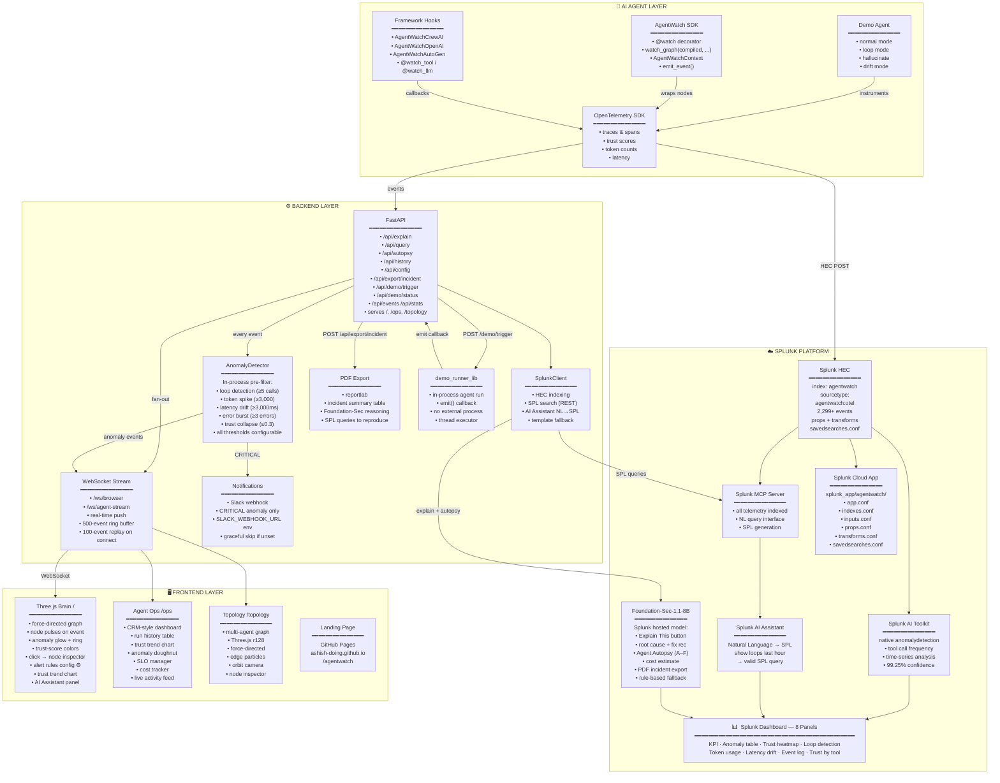
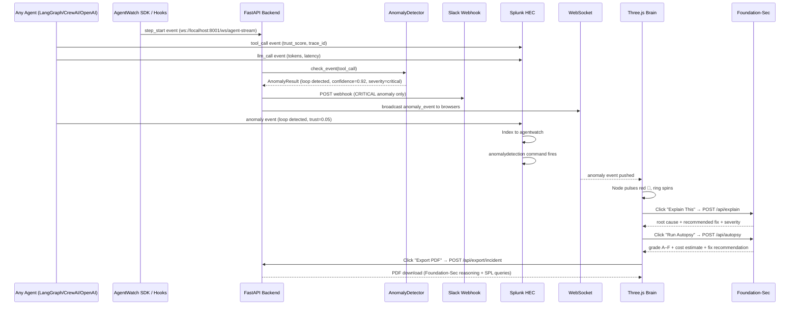
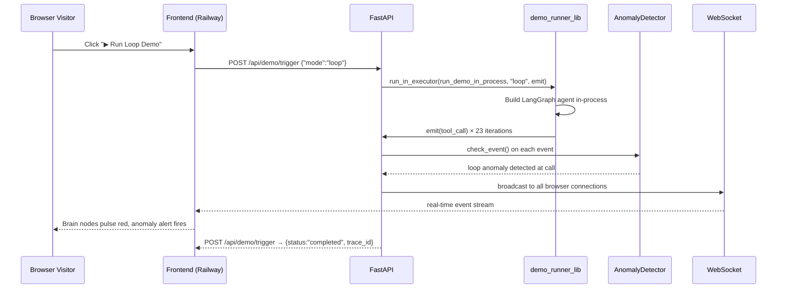
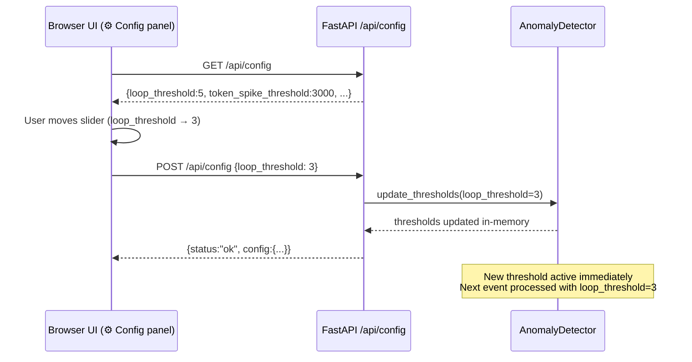

# AgentWatch — System Architecture

## Overview

AgentWatch is a real-time AI agent observability platform. It wraps any LangGraph, CrewAI, OpenAI Agents SDK, or AutoGen agent with the AgentWatch SDK (zero-config `@watch` / `watch_graph` / framework hooks), streams telemetry to Splunk via HEC, runs an in-process anomaly pre-filter before the events ever reach Splunk, and surfaces anomalies through three frontend pages (Live Brain, Agent Ops CRM, Multi-Agent Topology), an 8-panel Splunk dashboard, and a post-run Agent Autopsy graded A–F via Foundation-Sec-1.1-8B. CRITICAL anomalies fire Slack webhook notifications. All thresholds are configurable live via the UI.

---

## Architecture Diagram



---

## Data Flow — Real-Time Event Pipeline



---

## Data Flow — Public Live Demo (No Local Setup)



---

## Data Flow — Alert Rules Config



---

## Component Reference

### Agent Layer

| Component | File | Purpose |
|---|---|---|
| **AgentWatch SDK** | `backend/agentwatch_sdk.py` | Zero-config `@watch` / `watch_graph` / `AgentWatchContext` / `emit_event()` |
| **Framework Hooks** | `backend/agentwatch_hooks.py` | CrewAI · OpenAI Agents SDK · AutoGen · `@watch_tool` / `@watch_llm` generic decorators |
| **LangGraph Demo Agent** | `backend/agent/demo_agent.py` | 4 failure modes: normal, loop, hallucinate, drift |
| **Agent Runner (CLI)** | `backend/agent/agent_runner.py` | CLI wrapper — runs agent, sends events to HEC |
| **Demo Runner Lib** | `backend/agent/demo_runner_lib.py` | In-process variant — used by `/api/demo/trigger` |
| **OpenTelemetry Setup** | `backend/instrumentation/otel_setup.py` | `SplunkHECExporter` + `ConsoleStructuredExporter` |
| **LangGraph Hooks** | `backend/instrumentation/langgraph_hooks.py` | Node-level hooks that populate `AgentEvent` fields |

### Backend Layer

| Component | File | Purpose |
|---|---|---|
| **FastAPI App** | `backend/api/main.py` | REST + WebSocket server; all 14 endpoints; static serving for /, /ops, /topology |
| **AnomalyDetector** | `backend/instrumentation/anomaly_detector.py` | In-process pre-filter — loop, token spike, latency drift, error burst, trust collapse |
| **SplunkClient** | `backend/api/splunk_client.py` | HEC indexing, SPL search via REST, NL→SPL via AI Assistant |
| **Foundation-Sec Client** | `backend/api/foundation_sec.py` | Calls Splunk-hosted Foundation-Sec-1.1-8B; rule-based fallback |
| **Autopsy** | `backend/api/autopsy.py` | Post-run trace analysis — graded A–F, cost estimate, fix recommendation |
| **Notifications** | `backend/api/main.py` (inline) | Slack webhook for CRITICAL anomalies via `notify_slack_critical()` |
| **PDF Export** | `backend/api/main.py` (inline) | `POST /api/export/incident` → reportlab PDF |

### Splunk Platform

| Capability | Detail |
|---|---|
| **Splunk HEC** | `index=agentwatch`, `sourcetype=agentwatch:otel`, 2,299+ events indexed |
| **Splunk MCP Server** | All telemetry queryable via SPL from the UI |
| **Splunk AI Toolkit** | Native `anomalydetection` command — 139-tool-call spike at 99.25% confidence |
| **Splunk AI Assistant** | NL → SPL; e.g. "show me all loops in the last hour" → valid SPL |
| **Foundation-Sec-1.1-8B** | Powers "Explain This", "Run Autopsy", and PDF incident export |
| **Dashboard** | 8 panels: KPI, anomaly table, trust heatmap, loop chart, token usage, latency drift, event log, trust by tool |
| **Splunk Cloud App** | `splunk_app/agentwatch/` — app.conf, indexes.conf, inputs.conf, props.conf, transforms.conf, savedsearches.conf |

### Frontend Layer

| Module | File | Purpose |
|---|---|---|
| **Three.js Brain** | `frontend/index.html` + `src/brain.js` | Force-directed graph: nodes = steps, color = trust, pulse = event, ring = anomaly |
| **Agent Ops Dashboard** | `frontend/ops.html` | CRM dashboard: run history, trust trend, anomaly breakdown, SLOs, cost tracker |
| **Topology Map** | `frontend/topology.html` | Multi-agent force-directed graph: agent hubs, edge particles, orbit camera |
| **WebSocket Client** | `frontend/src/websocket.js` | WS connection with auto-reconnect; replay on connect |
| **Alert Overlays** | `frontend/src/alerts.js` | Anomaly alert banners + "Export PDF" button + Foundation-Sec explanation |
| **AI Assistant** | `frontend/src/assistant.js` | NL query → `/api/query` → SPL + results table |
| **Health Score** | `frontend/src/health_score.js` | Live composite health score |
| **Sparklines** | `frontend/src/sparklines.js` | Mini trust/token/latency sparklines |
| **Trace Timeline** | `frontend/src/trace_timeline.js` | Step-by-step trace timeline |
| **Autopsy Panel** | `frontend/src/autopsy_panel.js` | Post-run autopsy: grade, cost, root cause, fix |
| **Landing Page** | `docs/index.html` | GitHub Pages marketing site |

---

## Key Stats (Real Data)

| Metric | Value |
|--------|-------|
| Total events indexed | 2,299+ |
| Anomalies detected | 342 |
| Avg trust score | 58.1% |
| Total tokens processed | 279,993 |
| Loop spike confidence | 99.25% |
| Frameworks supported | 5 (LangGraph · CrewAI · OpenAI Agents · AutoGen · generic) |
| Frontend pages | 3 (Brain · Ops · Topology) |
| API endpoints | 14 |
| Splunk AI capabilities | 4 (MCP · AI Toolkit · Foundation-Sec · AI Assistant) |
| Splunk index | `agentwatch` |
| Source type | `agentwatch:otel` |
| Live demo | https://agentwatch-i555.onrender.com |

---

## Anomaly Detection Thresholds

| Anomaly Type | Trigger Condition | Severity | Confidence Formula | Configurable |
|---|---|---|---|---|
| **Loop** | Same tool called ≥ 5× in one trace | HIGH / CRITICAL (≥10×) | `min(0.99, 0.70 + (count−5) × 0.05)` | ✅ |
| **Token Spike** | `llm_total_tokens` ≥ 3,000 | MEDIUM / HIGH / CRITICAL | `min(0.95, 0.6 + ratio × 0.1)` | ✅ |
| **Latency Drift** | `duration_ms` ≥ 3,000ms | MEDIUM / HIGH (≥6,000ms) | `min(0.90, 0.65 + ms/threshold × 0.1)` | ✅ |
| **Error Burst** | ≥ 3 errors in one trace | HIGH / CRITICAL (≥5) | `min(0.95, 0.70 + count × 0.05)` | ✅ |
| **Trust Collapse** | `trust_score` ≤ 0.3 | MEDIUM / HIGH / CRITICAL | `min(0.90, 0.60 + (0.3−trust) × 2)` | ✅ |

All thresholds configurable live via `POST /api/config` or the **⚙ Config** panel in the UI.

---

## Trust Score Formula

```
trust = max(0.05, 1.0 / (1 + 0.3 × max(0, error_count − 3)))
```

| Error Count | Trust Score |
|---|---|
| 0–3 | 1.00 |
| 4 | 0.77 |
| 5 | 0.63 |
| 8 | 0.40 |
| 12 | 0.28 |
| 20+ | ~0.05 (floor) |

---

## API Endpoints

| Method | Endpoint | Purpose |
|---|---|---|
| `WS` | `/ws/agent-stream` | Agent → backend event stream |
| `WS` | `/ws/browser` | Backend → browser live events |
| `POST` | `/api/explain` | Anomaly explanation via Foundation-Sec |
| `POST` | `/api/query` | Natural language → SPL via AI Assistant |
| `POST` | `/api/autopsy` | Post-run trace analysis, grade A–F |
| `GET` | `/api/history` | Last 30 run summaries for trust trend chart |
| `GET` | `/api/config` | Current alert thresholds |
| `POST` | `/api/config` | Update alert thresholds live (takes effect immediately) |
| `POST` | `/api/export/incident` | Generate PDF incident report (reportlab) |
| `POST` | `/api/demo/trigger` | Trigger in-process demo run (normal/loop/hallucinate/drift) |
| `GET` | `/api/demo/status` | Check if a demo run is active |
| `GET` | `/api/events` | Recent events from ring buffer |
| `GET` | `/api/stats` | Live stats: event count, anomalies, avg trust |
| `GET` | `/api/health` | Backend health + Splunk connectivity check |
| `GET` | `/` | Serves Live Brain (`frontend/index.html`) |
| `GET` | `/ops` | Serves Agent Ops Dashboard (`frontend/ops.html`) |
| `GET` | `/topology` | Serves Topology Map (`frontend/topology.html`) |

---

## Environment Variables

| Variable | Default | Purpose |
|---|---|---|
| `SPLUNK_HOST` | `localhost` | Splunk server hostname |
| `SPLUNK_PORT` | `8089` | Splunk REST API port |
| `SPLUNK_HEC_PORT` | `8088` | HEC ingestion port |
| `SPLUNK_HEC_TOKEN` | — | HEC authentication token |
| `SPLUNK_USERNAME` | `admin` | REST API login |
| `SPLUNK_PASSWORD` | `changeme` | REST API password |
| `SPLUNK_INDEX` | `agentwatch` | Target index |
| `SPLUNK_AI_ENDPOINT` | — | Foundation-Sec API endpoint |
| `SPLUNK_AI_TOKEN` | — | Foundation-Sec auth token |
| `SLACK_WEBHOOK_URL` | — | Slack incoming webhook for CRITICAL alerts (optional) |
| `SPLUNK_URL` | `http://localhost:8000` | Splunk base URL for deep links in Slack messages |
| `OTEL_EXPORTER` | `console` | `splunk_hec` or `console` or `otlp` |
| `PUBLIC_DEMO_INDEX_TO_SPLUNK` | `false` | Index public demo runs to Splunk |

---

## Technology Stack

| Layer | Technology | Version |
|---|---|---|
| Agent framework | LangGraph | 0.2.28 |
| Framework hooks | CrewAI · OpenAI Agents SDK · AutoGen | via `agentwatch_hooks.py` |
| Observability | OpenTelemetry SDK | 1.27.0 |
| SDK | `agentwatch_sdk.py` + `agentwatch_hooks.py` | in-repo |
| Backend API | FastAPI + uvicorn | 0.115.4 / 0.32.0 |
| WebSocket | websockets | 13.1 |
| HTTP client | httpx | 0.27.2 |
| PDF generation | reportlab | ≥4.0.0 |
| Event transport | Splunk HEC | port 8088 |
| Anomaly detection (in-process) | `anomaly_detector.py` | in-repo |
| Anomaly detection (Splunk) | Splunk AI Toolkit `anomalydetection` | — |
| Natural language queries | Splunk AI Assistant | — |
| Hosted AI model | Foundation-Sec-1.1-8B | Splunk |
| Agent integration | Splunk MCP Server | — |
| 3D visualization (brain) | Three.js | r128 |
| 3D visualization (topology) | Three.js | r128 |
| Ops dashboard charts | Chart.js | 4.4.1 |
| Splunk app packaging | Native `.conf` files | splunk_app/ |
| Deployment | Railway | — |
| Frontend hosting | GitHub Pages | — |

---

## Splunk AI Capabilities Used

- ✅ **Splunk MCP Server** — all agent telemetry indexed and searchable via SPL
- ✅ **Splunk AI Assistant** — natural language to SPL query generation with template fallback
- ✅ **Foundation-Sec-1.1-8B** — Splunk-hosted model for "Explain This", "Run Autopsy", and PDF incident export
- ✅ **Splunk AI Toolkit** — native `anomalydetection` command on tool-call time-series (99.25% confidence on loop spike)