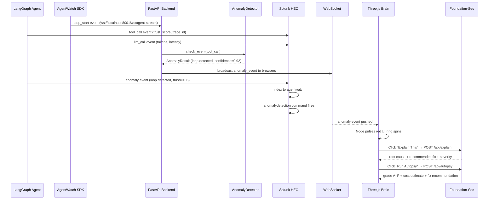
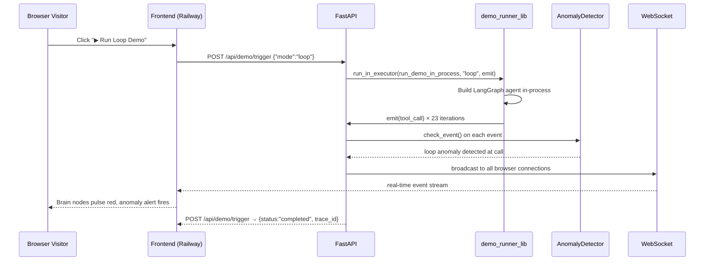

# AgentWatch — System Architecture

## Overview

AgentWatch is a real-time AI agent observability platform. It wraps any LangGraph agent with the AgentWatch SDK (zero-config `@watch` / `watch_graph`), streams telemetry to Splunk via HEC, runs an in-process anomaly pre-filter before the events ever reach Splunk, and surfaces anomalies through a Three.js brain visualization, an 8-panel Splunk dashboard, and a post-run Agent Autopsy graded A–F via Foundation-Sec-1.1-8B.

---

## Architecture Diagram

```mermaid
flowchart TD
    subgraph AGENT["🤖 AI AGENT LAYER"]
        SDK["AgentWatch SDK\n━━━━━━━━━━━━━━━\n• @watch decorator\n• watch_graph(compiled, ...)\n• AgentWatchContext\n• emit_event()"]
        LG["LangGraph Demo Agent\n━━━━━━━━━━━━━━━\n• normal mode\n• loop mode\n• hallucinate\n• drift mode"]
        OT["OpenTelemetry SDK\n━━━━━━━━━━━━━━━\n• traces & spans\n• trust scores\n• token counts\n• latency"]
        LG -->|instruments| OT
        SDK -->|wraps nodes| OT
    end

    subgraph BACKEND["⚙️ BACKEND LAYER"]
        API["FastAPI\n━━━━━━━━━━━━━━━\n• /explain  /query\n• /autopsy\n• /demo/trigger\n• /demo/status\n• /events  /stats\n• serves frontend static"]
        AD["AnomalyDetector\n━━━━━━━━━━━━━━━\nIn-process pre-filter:\n• loop detection (≥5 calls)\n• token spike (≥3,000)\n• latency drift (≥3,000ms)\n• error burst (≥3 errors)\n• trust collapse (≤0.3)"]
        WS["WebSocket Stream\n━━━━━━━━━━━━━━━\n• /ws/browser\n• /ws/agent-stream\n• real-time push\n• 500-event ring buffer\n• 100-event replay on connect"]
        SC["SplunkClient\n━━━━━━━━━━━━━━━\n• HEC indexing\n• SPL search (REST)\n• AI Assistant NL→SPL\n• template fallback"]
        DRL["demo_runner_lib\n━━━━━━━━━━━━━━━\n• in-process agent run\n• emit() callback\n• no external process\n• thread executor"]
        API -->|every event| AD
        API -->|fan-out| WS
        API --> SC
        API -->|POST /demo/trigger| DRL
        DRL -->|emit callback| API
        AD -->|anomaly events| WS
    end

    subgraph SPLUNK["☁️ SPLUNK PLATFORM"]
        HEC["Splunk HEC\n━━━━━━━━━━━━━━━\nindex: agentwatch\nsourcetype:\nagentwatch:otel\n1,269+ events"]
        AITK["Splunk AI Toolkit\n━━━━━━━━━━━━━━━\nnative anomalydetection\n• tool call frequency\n• time-series analysis\n• 99.25% confidence"]
        MCP["Splunk MCP Server\n━━━━━━━━━━━━━━━\n• all telemetry indexed\n• NL query interface\n• SPL generation"]
        ASST["Splunk AI Assistant\n━━━━━━━━━━━━━━━\nNatural Language → SPL\n\"show loops last hour\"\n→ valid SPL query"]
        FSEC["Foundation-Sec-1.1-8B\n━━━━━━━━━━━━━━━\nSplunk hosted model:\n• Explain This button\n• root cause + fix rec\n• Agent Autopsy (A–F)\n• cost estimate\n• rule-based fallback"]
        DASH["📊  Splunk Dashboard — 8 Panels\n━━━━━━━━━━━━━━━━━━━━━━━━━━━━━━━━━━━━━━━━━━━━━━\nKPI · Anomaly table · Trust heatmap · Loop detection\nToken usage · Latency drift · Event log · Trust by tool"]
        HEC --> AITK
        HEC --> MCP
        MCP --> ASST
        AITK --> DASH
        ASST --> DASH
        FSEC --> DASH
    end

    subgraph FRONTEND["🖥️ FRONTEND LAYER"]
        BRAIN["Three.js Brain\n━━━━━━━━━━━━━━━\n• force-directed graph\n• node pulses on event\n• anomaly glow + ring\n• trust-score colors\n• click → node inspector"]
        FEED["Live Events Feed\n━━━━━━━━━━━━━━━\n• anomaly alert overlays\n• node inspector panel\n• Foundation-Sec result"]
        UIEX["Extended UI Modules\n━━━━━━━━━━━━━━━\n• health_score.js\n• sparklines.js\n• trace_timeline.js\n• autopsy_panel.js\n• assistant.js (NL→SPL)"]
        LAND["Landing Page\n━━━━━━━━━━━━━━━\nGitHub Pages\nashish-doing.github.io\n/agentwatch"]
    end

    OT -->|HEC POST| HEC
    OT -->|events| API
    SC -->|SPL queries| MCP
    SC -->|explain + autopsy| FSEC
    WS -->|WebSocket| BRAIN
    WS --> FEED
    WS --> UIEX
```

---

## Data Flow — Real-Time Event Pipeline



---

## Data Flow — Public Live Demo (No Local Setup)



---

## Component Reference

### Agent Layer

| Component | File | Purpose |
|---|---|---|
| **AgentWatch SDK** | `backend/agentwatch_sdk.py` | Zero-config `@watch` / `watch_graph` / `AgentWatchContext` / `emit_event()` |
| **LangGraph Demo Agent** | `backend/agent/demo_agent.py` | 4 failure modes: normal, loop, hallucinate, drift |
| **Agent Runner (CLI)** | `backend/agent/agent_runner.py` | CLI wrapper — runs agent, sends events to HEC via `rich` console |
| **Demo Runner Lib** | `backend/agent/demo_runner_lib.py` | In-process variant — used by `/api/demo/trigger`, no subprocess |
| **OpenTelemetry Setup** | `backend/instrumentation/otel_setup.py` | `SplunkHECExporter` + `ConsoleStructuredExporter`, `BatchSpanProcessor` |
| **LangGraph Hooks** | `backend/instrumentation/langgraph_hooks.py` | Node-level hooks that populate `AgentEvent` fields |

### Backend Layer

| Component | File | Purpose |
|---|---|---|
| **FastAPI App** | `backend/api/main.py` | REST + WebSocket server; serves frontend static files; demo trigger; autopsy endpoint |
| **AnomalyDetector** | `backend/instrumentation/anomaly_detector.py` | In-process pre-filter — loop, token spike, latency drift, error burst, trust collapse |
| **SplunkClient** | `backend/api/splunk_client.py` | HEC indexing, SPL search via REST, NL→SPL via AI Assistant (with template fallback) |
| **Foundation-Sec Client** | `backend/api/foundation_sec.py` | Calls Splunk-hosted Foundation-Sec-1.1-8B; rule-based fallback for local dev |
| **Autopsy** | `backend/api/autopsy.py` | Post-run trace analysis — graded A–F, cost estimate, fix recommendation |

### Splunk Platform

| Capability | Detail |
|---|---|
| **Splunk HEC** | `index=agentwatch`, `sourcetype=agentwatch:otel`, 1,269+ events indexed |
| **Splunk MCP Server** | All telemetry queryable via SPL from the UI |
| **Splunk AI Toolkit** | Native `anomalydetection` command — caught 139-tool-call spike at 99.25% confidence |
| **Splunk AI Assistant** | NL → SPL; e.g. "show me all loops in the last hour" → valid SPL |
| **Foundation-Sec-1.1-8B** | Splunk-hosted model; powers "Explain This" and "Run Autopsy" |
| **Dashboard** | 8 panels: KPI, anomaly table, trust heatmap, loop chart, token usage, latency drift, event log, trust by tool |

### Frontend Layer

| Module | File | Purpose |
|---|---|---|
| **Three.js Brain** | `frontend/src/brain.js` | Force-directed graph: nodes = steps, color = trust, pulse = event, ring = anomaly |
| **WebSocket Client** | `frontend/src/websocket.js` | WS connection with auto-reconnect; replay on connect; demo simulation fallback |
| **Alert Overlays** | `frontend/src/alerts.js` | Anomaly alert banners with Foundation-Sec explanation |
| **AI Assistant** | `frontend/src/assistant.js` | NL query input → `/api/query` → renders SPL + results table |
| **Health Score** | `frontend/src/health_score.js` | Live composite health score updated per event |
| **Sparklines** | `frontend/src/sparklines.js` | Mini trust/token/latency sparkline charts |
| **Trace Timeline** | `frontend/src/trace_timeline.js` | Step-by-step trace timeline visualization |
| **Autopsy Panel** | `frontend/src/autopsy_panel.js` | Post-run autopsy display: grade, cost, root cause, fix |
| **Landing Page** | `docs/index.html` | GitHub Pages marketing site |

---

## Key Stats (Real Data)

| Metric | Value |
|--------|-------|
| Total events indexed | 1,269+ |
| Anomalies detected | 180 |
| Avg trust score | 59.7% |
| Total tokens processed | 159,970 |
| Loop spike confidence | 99.25% |
| Splunk index | `agentwatch` |
| Source type | `agentwatch:otel` |
| Live demo | https://agentwatch-production-4a86.up.railway.app |

---

## Anomaly Detection Thresholds

| Anomaly Type | Trigger Condition | Severity | Confidence Formula |
|---|---|---|---|
| **Loop** | Same tool called ≥ 5× in one trace | HIGH / CRITICAL (≥10×) | `min(0.99, 0.70 + (count−5) × 0.05)` |
| **Token Spike** | `llm_total_tokens` ≥ 3,000 | MEDIUM / HIGH / CRITICAL | `min(0.95, 0.6 + ratio × 0.1)` |
| **Latency Drift** | `duration_ms` ≥ 3,000ms | MEDIUM / HIGH (≥6,000ms) | `min(0.90, 0.65 + ms/threshold × 0.1)` |
| **Error Burst** | ≥ 3 errors in one trace | HIGH / CRITICAL (≥5) | `min(0.95, 0.70 + count × 0.05)` |
| **Trust Collapse** | `trust_score` ≤ 0.3 | MEDIUM / HIGH / CRITICAL | `min(0.90, 0.60 + (0.3−trust) × 2)` |

---

## Trust Score Formula

Trust degrades after the 3rd error in a trace, mirroring `anomaly_detector.py`:

```
trust = max(0.05, 1.0 / (1 + 0.3 × max(0, error_count − 3)))
```

| Error Count | Trust Score |
|---|---|
| 0–3 | 1.00 |
| 4 | 0.77 |
| 5 | 0.63 |
| 8 | 0.40 |
| 12 | 0.28 |
| 20+ | ~0.05 (floor) |

---

## API Endpoints

| Method | Endpoint | Purpose |
|---|---|---|
| `WS` | `/ws/agent-stream` | Agent → backend event stream |
| `WS` | `/ws/browser` | Backend → browser live events |
| `POST` | `/api/explain` | Anomaly explanation via Foundation-Sec |
| `POST` | `/api/query` | Natural language → SPL via AI Assistant |
| `POST` | `/api/autopsy` | Post-run trace analysis, grade A–F |
| `POST` | `/api/demo/trigger` | Trigger in-process demo run (mode: normal/loop/hallucinate/drift) |
| `GET` | `/api/demo/status` | Check if a demo run is active |
| `GET` | `/api/events` | Recent events from ring buffer |
| `GET` | `/api/stats` | Live stats: event count, anomalies, avg trust |
| `GET` | `/api/health` | Backend health + Splunk connectivity check |
| `GET` | `/` | Serves `frontend/index.html` (static) |

---

## Environment Variables

| Variable | Default | Purpose |
|---|---|---|
| `SPLUNK_HOST` | `localhost` | Splunk server hostname |
| `SPLUNK_PORT` | `8089` | Splunk REST API port |
| `SPLUNK_HEC_PORT` | `8088` | HEC ingestion port |
| `SPLUNK_HEC_TOKEN` | — | HEC authentication token |
| `SPLUNK_USERNAME` | `admin` | REST API login |
| `SPLUNK_PASSWORD` | `changeme` | REST API password |
| `SPLUNK_INDEX` | `agentwatch` | Target index |
| `SPLUNK_AI_ENDPOINT` | — | Foundation-Sec API endpoint |
| `SPLUNK_AI_TOKEN` | — | Foundation-Sec auth token |
| `OTEL_EXPORTER` | `console` | `splunk_hec` or `console` or `otlp` |
| `PUBLIC_DEMO_INDEX_TO_SPLUNK` | `false` | Index public demo runs to Splunk |

---

## Technology Stack

| Layer | Technology | Version |
|---|---|---|
| Agent framework | LangGraph | 0.2.28 |
| Observability | OpenTelemetry SDK | 1.27.0 |
| SDK | `agentwatch_sdk.py` | in-repo |
| Backend API | FastAPI + uvicorn | 0.115.4 / 0.32.0 |
| WebSocket | websockets | 13.1 |
| HTTP client | httpx | 0.27.2 |
| Event transport | Splunk HEC | port 8088 |
| Anomaly detection (in-process) | `anomaly_detector.py` | in-repo |
| Anomaly detection (Splunk) | Splunk AI Toolkit `anomalydetection` | — |
| Natural language queries | Splunk AI Assistant | — |
| Hosted AI model | Foundation-Sec-1.1-8B | Splunk |
| Agent integration | Splunk MCP Server | — |
| 3D visualization | Three.js | r128 |
| Deployment | Railway | — |
| Frontend hosting | GitHub Pages | — |

---

## Splunk AI Capabilities Used

- ✅ **Splunk MCP Server** — all agent telemetry indexed and searchable via SPL
- ✅ **Splunk AI Assistant** — natural language to SPL query generation with template fallback
- ✅ **Foundation-Sec-1.1-8B** — Splunk-hosted model for "Explain This" + full post-run Agent Autopsy
- ✅ **Splunk AI Toolkit** — native `anomalydetection` command on tool-call time-series (99.25% confidence on loop spike)