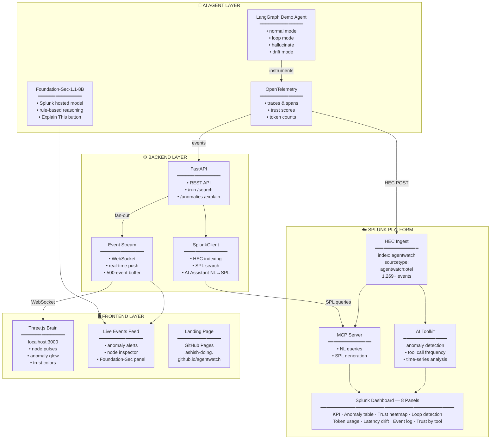
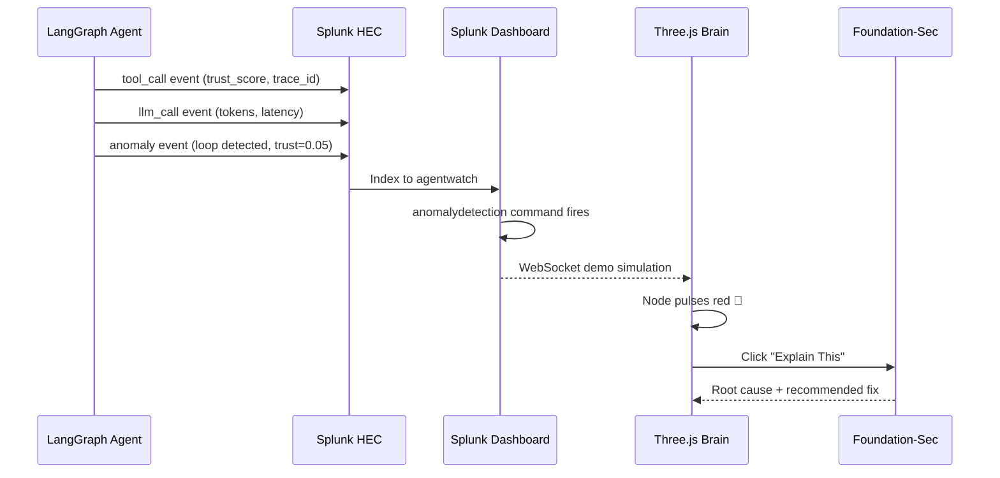

# AgentWatch — System Architecture

## Overview

AgentWatch is a real-time AI agent observability platform that instruments LangGraph agents with OpenTelemetry, streams telemetry to Splunk via HEC, and visualizes trust scores and anomalies through a Three.js brain visualization and Splunk dashboards.

---

## Architecture Diagram

---

## Data Flow

---

## Key Stats (Real Data)

| Metric | Value |
|--------|-------|
| Total events indexed | 1,269+ |
| Anomalies detected | 180 |
| Avg trust score | 59.7% |
| Total tokens processed | 159,970 |
| Splunk index | `agentwatch` |
| Source type | `agentwatch:otel` |

---

## Technology Stack

| Layer | Technology |
|-------|-----------|
| Agent framework | LangGraph (Python) |
| Observability | OpenTelemetry |
| Backend API | FastAPI + WebSockets |
| Event transport | Splunk HEC (port 8088) |
| Anomaly detection | Splunk AI Toolkit — `anomalydetection` |
| Natural language queries | Splunk AI Assistant (NL→SPL) |
| Hosted AI model | Foundation-Sec-1.1-8B (Splunk) |
| Agent integration | Splunk MCP Server |
| 3D visualization | Three.js r128 |
| Frontend hosting | GitHub Pages |

---

## Splunk AI Capabilities Used

- ✅ **Splunk MCP Server** — all agent telemetry indexed and searchable via SPL
- ✅ **Splunk AI Assistant** — natural language to SPL query generation
- ✅ **Foundation-Sec-1.1-8B** — hosted model for anomaly explanation ("Explain This")
- ✅ **Splunk AI Toolkit** — native `anomalydetection` command on tool call time-series